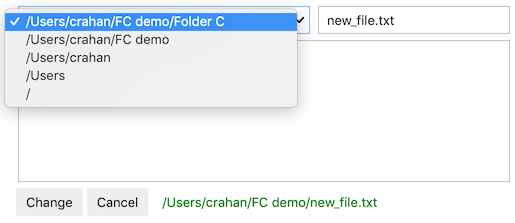

# ipyfilechooser

A simple Python file chooser widget for use in Jupyter/IPython in conjunction with ipywidgets. The selected path and file are available via `.selected_path` and `.selected_filename` respectvely or as a single combined filepath via `selected`. The dialog can be reset to its default path and filename by using `.reset()`. 

When a typed filename matches an existing file entry in the current folder the entry will be highlighted. To emphasize the risk of overwriting existing files, the selected filepath is displayed in green if the file does not exist and orange if it does.

## Usage

```
from ipyfilechooser import FileChooser

# Create and display a FileChooser widget
fc = FileChooser('/Users/crahan/Projects/Jupyter/ipywidgets')
display(fc)

# Print the selected path, filename, or both
print(fc.selected_path)
print(fc.selected_filename)
print(fc.selected)

# Change defaults and reset
fc.default_path = '/Users/crahan/Projects'
fc.default_filename = 'output.txt'
fc.reset()

# Shorthand reset
fc.reset(path='/Users/crahan/Projects', filename='output.txt')
```

## Functions and variables

```
fc.reset()
fc.default
fc.default_path
fc.default_filepath
fc.selected
fc.selected_path
fc.selected_filename
```

## Screenshots

### Closed vs open dialog


### Existing vs new file selection


### Quick navigation dropdown


